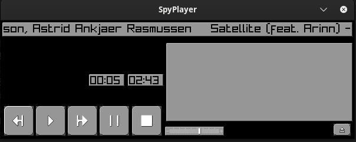

# SpyPlayer

Yet another music player inspired by the likes of WinAmp, written in [Odin](https://github.com/odin-lang/Odin).

This uses raylib to render the GUI and play music, and is currently only tested on Linux.



## Features

This is a work in progress, and is not yet feature complete.

- [x] Plays audio files - only tested on mp3 files
- [x] Play, pause, stop, next, previous
- [x] Volume control
- [x] Use threading to load audio files
- [ ] Use threading to manage the audio playback
- [ ] Shows a popup when an error occurs
- [ ] Repeat
- [ ] Seeking
- [ ] Playlists
- [ ] Show metadata - title and artist at the moment
- [ ] Show album art
- [ ] EQ
- [ ] Current time and total time
- [ ] Current Playlist
- [ ] Other things I haven't figured out yet

## Contributions

Contributions are welcome!

If you want to contribute, create a pull request and I will review it.

I'm currently focusing on supporting Linux first. If you want other platforms to be supported, please create a pull request.

## How to build

### Build Dependencies

- [Odin](https://github.com/odin-lang/Odin) to compile the code

### Runtime Dependencies

- ffprobe to get metadata from audio files, usually installed with ffmpeg
- zenity or kdialog to show popups, depends on the desktop environment
- opengl or vulkan to render the GUI, should be installed along with your graphics driver

All, except Odin, should already be installed on most Linux distributions.

### Install Odin

```sh
cd ~/
git clone https://github.com/odin-lang/Odin
cd Odin
./build_odin.sh
```

You can add odin to your path by creating a symlink to the odin binary in your local bin directory.

```sh
ln -s ~/Odin/odin ~/.local/bin
```

### Build

```sh
odin build .
```

### How to run

```sh
./SpyPlayer
```
