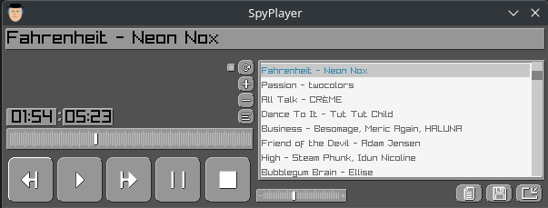

# SpyPlayer

Yet another music player, written in [Odin](https://github.com/odin-lang/Odin).

Raylib is used for playback and UI rendering. A custom Aseprite sprite sheet parser is used to load sprites and to help position the sprites for custom controls. Currently only Button, Slider and Text controls are implemented. `ffprobe` is used to get metadata from audio files.



## Features

This is a work in progress.

I'm adding features as I go, so if you want something that isn't there, please create a pull request. I use this daily and I add feautres when I encounter a need for them.

If you want a feature that isn't there, please create a pull request or open an issue and I'll see what I can do.

- [x] Plays audio files - only tested on mp3 files
- [x] Play, pause, stop, next, previous
- [x] Load from folder to current playlist
- [x] Volume control
- [x] Use threading to load audio files
- [x] Current time and total time
- [x] Play next song when finished playing current song
- [x] Seeking
- [x] Visualizer
  - [x] Spectrum
    - [x] FFT
- [x] Tooltips for controls
  - [ ] Delay before showing tooltips
- [x] Keyboard shortcuts
  - [x] Save and load key bindings
  - [x] Default key bindings
- [ ] Playlist management
  - [x] Load from folder
  - [x] Playlist showing loaded songs
  - [x] Selecting a song plays that song
  - [x] Save playlist
  - [x] Load playlist
  - [x] Automatic loadind of playlist from config
  - [x] Automatic saving of playlist to config
  - [x] Shuffle playlist
  - [ ] Add to playlist
  - [ ] Remove from playlist
  - [ ] Clear playlist
- [ ] Show metadata
  - [x] Title
  - [x] Artist
  - [ ] Album
  - [ ] Genre
- [x] Supported operating systems
  - [ ] Windows - It should compile, but I can't verify that it works as OpenGL is not supported on Windows in my VM's
  - [x] Linux - Daily tested on Fedora 40
- [ ] Other things I haven't figured out yet

## Contributions

Contributions are welcome!

If you want to contribute, create a pull request and I will review it.

I'm currently focusing on supporting Linux first. If you want other platforms to be supported, please create a pull request.

## How to build

### Build Dependencies

- [Odin](https://github.com/odin-lang/Odin) to compile the code

### Runtime Dependencies

- ffprobe to get metadata from audio files, usually installed with ffmpeg
- zenity or kdialog to show popups, depends on the desktop environment
- opengl or vulkan to render the GUI, should be installed along with your graphics driver

All, except Odin, should already be installed on most Linux distributions.

### Install Odin Linux

```sh
cd ~/
git clone https://github.com/odin-lang/Odin
cd Odin
./build_odin.sh
```

You can add odin to your path by creating a symlink to the odin binary in your local bin directory.

```sh
ln -s ~/Odin/odin ~/.local/bin
```

### Install Odin Windows

See [Build Odin from Source](https://odin-lang.org/docs/install/#windows)

### Build and Run

#### Linux

```sh
./build.sh
./SpyPlayer
```

#### Windows

```powershell
./build.ps1
SpyPlayer.exe
```
